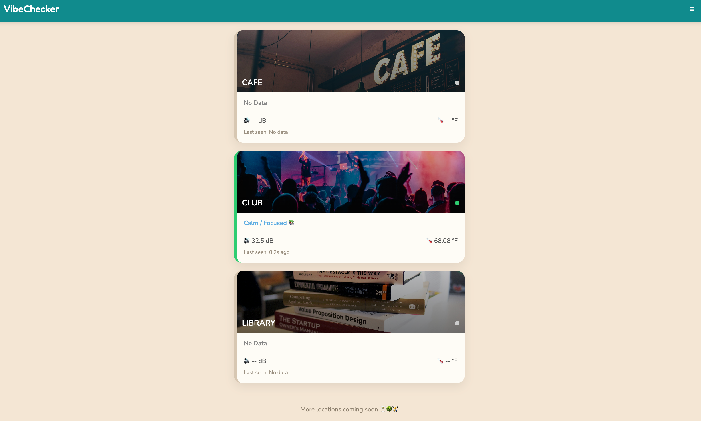
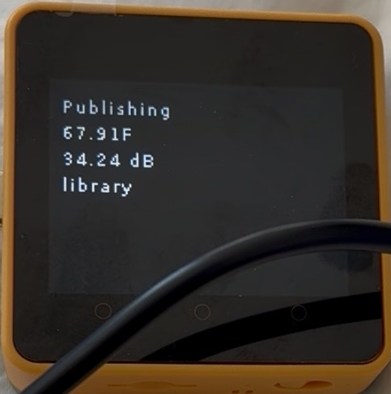
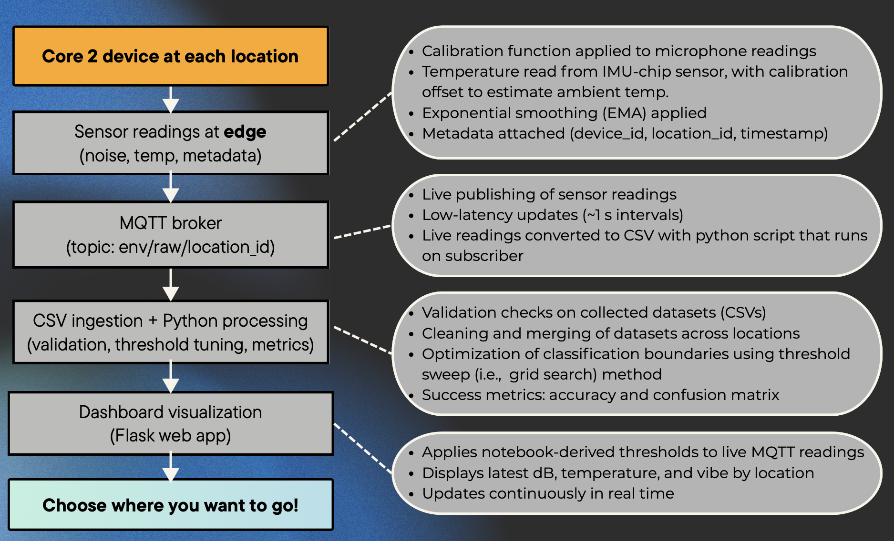

# VibeChecker: Real-Time AIoT Environment Classification Platform

---

## Project Overview

VibeChecker is an AIoT system that classifies real-world environments in real time using live sensor data from an **M5Stack Core2** device.

The system estimates ambient noise levels, processes sensor readings, and classifies locations into three environment categories:

- **Library** → Calm / Focused 📚
- **Cafe** → Moderate / Social ☕
- **Club** → Loud / Energetic 🔥

VibeChecker combines:

1. **Offline analytics & model development** (Jupyter Notebook)
2. **Real-time inference & dashboard deployment** (Flask + MQTT)

---

## Business / Practical Use Case

Choosing where to study, socialize, or work can be difficult without knowing real-time conditions.

VibeChecker demonstrates how IoT devices can continuously monitor environmental signals and provide live recommendations such as:

- Which cafe is quiet enough to work in
- Which library is currently crowded or noisy
- Which social venue is energetic right now
- Real-time occupancy / activity indicators

This concept can scale to smart campuses, coworking spaces, hospitality, and city analytics.

---

## System Architecture

### Offline Data Collection / Validation Pipeline

```
M5Stack Core2 → MQTT Broker → mqtt_to_csv.py → CSV datasets → vibe_processing.ipynb
```

### Real-Time Production Pipeline

```
M5Stack Core2 → MQTT Broker → Flask App (app.py) → Live Dashboard
```

---

## Data Schema

### MQTT Topic

```text
env/raw/{location_id}
```

### Example Payload

```json
{
  "device_id": "core2_mcb2318",
  "location_id": "library",
  "timestamp": 1775828541,
  "temperature_f": 72.5,
  "noise_level_db": 31.2
}
```

### Fields

- `device_id` → Device identifier
- `location_id` → library / cafe / club
- `timestamp` → Epoch timestamp
- `temperature_f` → Estimated ambient temperature
- `noise_level_db` → Calibrated noise estimate

---

## On-Device Edge Processing

The Core2 performs lightweight feature engineering before transmission.

### Audio Processing

- Audio sampling at ~8 kHz
- RMS computed over buffered audio windows
- Log scaling applied to estimate decibel levels
- Clamp logic to stabilize extreme values
- Exponential moving average smoothing

### Temperature Processing

- MPU-6050 chip temperature read
- Calibration offset applied
- Converted to Fahrenheit
- Smoothed before publish

### Publish Settings

- MQTT QoS = 0
- Retain = False
- Publish interval ≈ 1 second

---

## Dataset Collection

We simulated three real-world environments:

- Library (quiet)
- Cafe (moderate)
- Club (loud)

### Final Dataset

- 12 total runs
- 4 runs per environment
- ~3 minutes per run
- ~4,300+ processed observations

This expanded dataset was collected after instructor feedback requesting additional validation data.

---

## Data Science Workflow (`vibe_processing.ipynb`)

The notebook performs:

- Dataset ingestion & merging
- Cleaning / duplicate checks
- Missing-value validation
- Exploratory analysis
- Threshold optimization
- Confusion matrix evaluation
- Baseline ML comparison

---

## Threshold Optimization (Grid Search)

A threshold sweep was used to determine optimal environment boundaries.

### Final Thresholds

- Library: noise < 37 dB
- Cafe: 37 ≤ noise < 56 dB
- Club: noise ≥ 56 dB

These thresholds were selected after expanding the dataset to 12 runs.

---

## Deployed Rule-Based Classifier

```python
if noise < 37:
    vibe = "Calm / Focused 📚"
elif noise < 56:
    vibe = "Moderate / Social ☕"
else:
    vibe = "Loud / Energetic 🔥"
```

---

## Model Comparison

To benchmark the handcrafted classifier, we compared it against Multiclass Logistic Regression using:

- `noise_level_db`
- `temperature_f`

### Results

| Model | Accuracy |
|---|---:|
| Rule-Based Threshold Model | 96.28% |
| Logistic Regression | 96.64% |
| Random Validation Accuracy | ~93% |

### Interpretation

Both models performed nearly identically.

The threshold model was retained for deployment because it offers:

- Full interpretability
- Zero retraining requirements
- Lower compute overhead
- Simple edge deployment logic

---

## Real-Time Flask Dashboard

The production system uses the optimized thresholds from the notebook.

### Responsibilities

- Subscribes to MQTT stream
- Stores latest reading per location
- Applies classifier in real time
- Detects inactive devices
- Serves dashboard via `/live`

### Dashboard Features

- Live updates every second
- Multi-location tiles
- Noise + temperature display
- Activity / offline detection
- Real-time vibe labels

---

## Screenshots

### Live Dashboard


### Device Output


### Architecture


---

## Validation & Observability

### Validation Checks

- Row counts
- Missing values
- Duplicate detection
- Accuracy scoring
- Confusion matrices

### Operational Monitoring

- LCD device output
- Serial logs
- MQTT stream visibility
- CSV persistence
- Flask request logs

---

## How to Run

### 1. Start MQTT Broker

```bash
brew services start mosquitto
```

### 2. Generate CSV Data (Optional)

```bash
python mqtt_to_csv.py
```

### 3. Run Device Code

Upload via **UIFlow 2.0** and start on the Core2.

### 4. Run the Notebook

Open and run all cells:

```
vibe_processing.ipynb
```

### 5. Launch the Dashboard

```bash
python app.py
```

Then open:

```
http://127.0.0.1:5000
```

---

## Repository Structure

```
VibeChecker/
│
├── device/                  # M5Stack Core2 firmware (UIFlow 2.0)
├── data/                    # Captured sensor data (CSV)
├── templates/               # Flask HTML templates
├── vibe_processing.ipynb    # Data processing & model training
├── mqtt_to_csv.py           # MQTT subscriber → CSV logger
├── app.py                   # Flask dashboard + inference server
└── README.md
```

---

## Limitations

- Noise values are approximated, not certified SPL meter readings
- Temperature is estimated from onboard chip temperature
- Current model uses only 3 environment classes
- Local-network MQTT deployment
- Single-device proof of concept

---

## Future Improvements

- Random Forest / XGBoost / TinyML edge models
- Additional sensors: light, occupancy, motion
- Multi-device deployments
- AWS IoT / cloud streaming architecture
- Mobile recommendation app
- Adaptive retraining with new locations

---

## Key Takeaway

VibeChecker demonstrates a complete end-to-end AIoT pipeline:

> **Sensor Device → MQTT → Storage → Analytics → Real-Time Inference → Dashboard**

It combines embedded sensing, data engineering, model validation, and production deployment into one working system.
